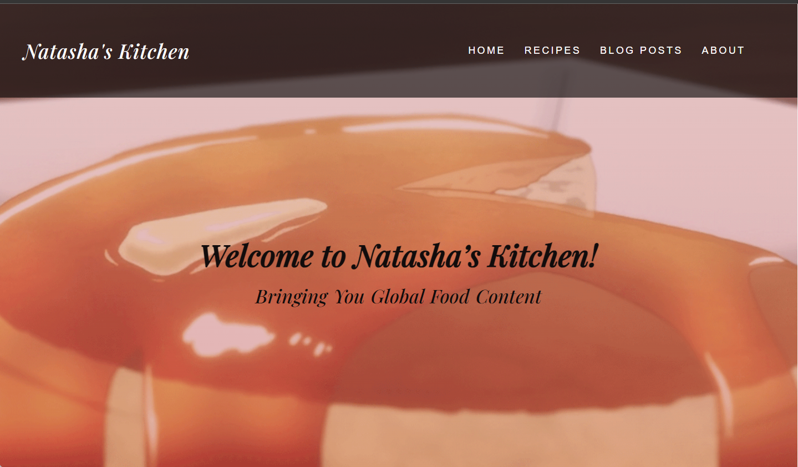

# Food Blog

This is a static website for a food blog written entirely in HTML and CSS. The blog offers offers users a variety of recipes and food related content.

 
The goal of this app was to practice my frontend development skills by producing content without using any frameworks, servers, or databases. My inspiration for this site was the real Natasha's Kitchen (https://natashaskitchen.com/) ! 

##

Please click [here](https://mat-food-blog.netlify.app/) to view the site.
